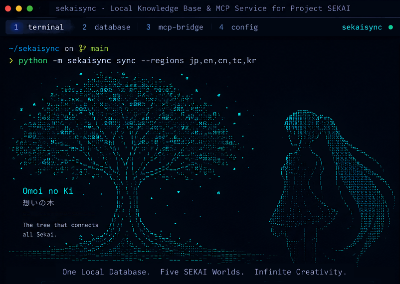

<!-- readme-brand:start -->
<picture>
  <source media="(prefers-color-scheme: dark)" srcset=".github/readme/header-dark.svg">
  
</picture>
<!-- readme-brand:end -->

# SekaiSync

[English](README.md) | 中文

[](pyproject.toml) [](pyproject.toml) [](pyproject.toml) [](LICENSE)

<!-- readme-navigation:start -->
<p>
  <a href="#readme-overview">项目介绍</a> ·
  <a href="#readme-section-02">快速开始</a> ·
  <a href="#readme-section-08">更多说明</a>
</p>
<!-- readme-navigation:end -->

<a id="readme-overview"></a>

> 面向《世界计划 缤纷舞台！》（Project SEKAI）的本地知识库与 AI 智能体上下文（MCP）服务。

**SekaiSync** 为大语言模型及编码智能体（如 Claude、Cursor、ChatGPT）提供游戏领域上下文。项目将《世界计划》的官方 Master Data、多区服本地化译名与社区剧情正文同步至本地 `store/` 目录，通过 **MCP（模型上下文协议）** 或命令行提供检索能力，使智能体直接基于**本地数据**回答问题，减少依赖参数记忆导致的事实性错误。

<p align="center">
  
</p>

<a id="readme-section-01"></a>

## ✨ 核心特性

- ⚡ **零外部依赖**：完全基于 Python 3.10+ 标准库构建，无需安装第三方运行依赖。
- 🌐 **五区服数据对齐**：支持 JP、EN、CN、TC（繁体中文）与 KR 五大区服的 Master Data 同步及跨语言译名映射。
- 🤖 **原生支持 MCP**：内置MCP stdio 与 Streamable HTTP 服务，支持接入 Claude Desktop、Cursor 及自动化工作流。
- 🛡️ **严格的数据边界**：遵循「未覆盖即如实报告」原则，防止智能体臆造设定。
- 📰 **灵活的数据扩展**：支持官方公告同步，并在遵循使用条款的前提下支持社区剧情正文抓取。

<a id="readme-section-02"></a>

## 🚀 快速开始

### 1. 安装

```bash
git clone <repo-url> sekaisync
cd sekaisync
pip install .
```
> 💡 *项目无第三方依赖，亦可直接使用 `python -m sekaisync <command>` 运行，无需事先安装。*

### 2. 初始化与数据同步

```bash
# 初始化本地 store（v2 布局）
python -m sekaisync init

# 同步五区服 Master Data
python -m sekaisync sync --regions jp,en,cn,tc,kr

# （可选）同步官方公告
python -m sekaisync news sync
```

### 3. 本地查询与检查

```bash
# 跨语言译名解析（如把「星乃一歌」解析为英文）
python -m sekaisync resolve --query "星乃一歌" --target-language en

# 按语言定向查询
python -m sekaisync lookup --query "Hoshino Ichika" --language zh_tw

# 综合知识库查询
python -m sekaisync query --query "Hoshino Ichika"

# 查看知识库与同步状态
python -m sekaisync status
python -m sekaisync kb-status
```

<a id="readme-section-03"></a>

## 🤖 Agent 接入（MCP）

SekaiSync 提供标准的 **MCP（Model Context Protocol）** 实现，便于集成到 LLM 工作流中：

### 本地 Agent（Claude Desktop / Cursor）
通过标准输入输出（stdio）启动服务：
```bash
python -m sekaisync serve-mcp
```

### 远程 / Web Agent（ChatGPT Custom Actions / HTTP）
启动 HTTP + MCP Streamable 服务：
```bash
python -m sekaisync serve-http --host 127.0.0.1 --port 8787
```
> 详细配置示例（如 `claude_desktop_config.json`）请参考 [`agents/README.zh-CN.md`](agents/README.zh-CN.md)。

<a id="readme-section-04"></a>

## 📊 数据范围与边界

SekaiSync 的本地存储范围如下：

| 类别 | 覆盖状态 | 说明 |
| :--- | :---: | :--- |
| **五区服 Master Data** | ✅ 包含 | 卡牌、活动、歌曲、角色等官方元数据 |
| **本地化术语** | ✅ 包含 | 角色、歌曲、专用名词在 JP/EN/CN/TC/KR 间的跨语言映射 |
| **官方公告** | ✅ 包含 | 通过 `news sync` 命令同步获取 |
| **社区剧情正文** | ⚠️ 可选 | 仅限文本；需配置自定义端点并执行 `crawl` |
| **多媒体资产 / 运行时数据** | ❌ 不包含 | 不存储图片、音频、Live2D、谱面源文件或实时玩家数据 |

> 📌 **防幻觉设计**：当查询内容超出当前 `store/` 覆盖范围时，SekaiSync 将显式返回 `not covered`，指导智能体如实说明「当前数据未收录」，避免自行推测。

<a id="readme-section-06"></a>

## ⚙️ 高级配置（`settings.json`）

`sync` 命令（Master Data）默认通过公开社区仓库获取，无需额外配置。

若需使用 `crawl`（社区剧情文本抓取）或自定义公告源，请在 `settings.json` 中配置对应端点：

```json
{
  "version": 2,
  "sites": [
    {
      "id": "altsource_sv",
      "backend": "sekai_viewer",
      "enabled": true,
      "master_base": "<your_master_endpoint>",
      "asset_base": "<your_asset_endpoint>",
      "asset_buckets": { "jp": "<your_jp_asset_bucket>" },
      "i18n_base": "<your_i18n_endpoint>"
    },
    {
      "id": "altsource_ms",
      "backend": "moesekai",
      "enabled": true,
      "site_base": "<your_site_address>",
      "sitemap_url": "<your_sitemap_url>",
      "metadata_bases": ["<your_metadata_endpoint>"],
      "asset_bases": ["<your_asset_endpoint>"],
      "translation_base": "<your_translation_endpoint>",
      "news_base": "<your_news_endpoint>"
    }
  ]
}
```

> **使用规范与合规说明**：
> - 请确保已阅读并同意游戏服务协议，并遵守目标站点的 `robots.txt` 与内容信号。SekaiSync 仅抓取纯文本内容。
> - 执行 `crawl` 命令（通过 `--accept-tos` 参数或交互式确认）即表示使用者确认同意遵守相关游戏服务条款。
> - 兼容当前主流的两类公开 Web 数据库系统，不代表 SekaiSync 官方认可或建议连接任何特定第三方实例。

<a id="readme-section-08"></a>

## 📜 许可证与免责声明

- 本项目采用 [MIT 许可证](LICENSE) 分发。
- 仓库**不包含、不捆绑任何原始游戏二进制文件或多媒体资产**。`sync` 功能依赖公开的 Master Data 镜像；投入生产或公开使用前，使用者应自行核验数据源许可及游戏服务条款。
